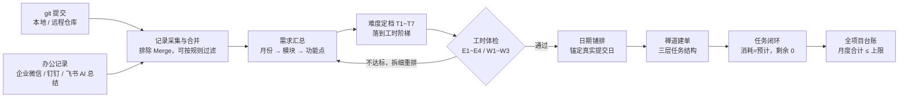

# git2zentao · Git 提交一键转禅道任务

<p align="center">
  <b>工时汇报自动化 · 打工人的福音 · 懒人必备</b><br>
  把「我这段时间干了什么」——git 提交 + 企业微信/钉钉/飞书里的办公记录——
  自动变成禅道里结构清晰、工时合理、时间可追溯的任务
</p>

<p align="center">
  <a href="LICENSE"></a>
  = 18">
  
  
  
  <a href="https://github.com/1414894911/git2zentao/releases"></a>
  
  <a href="https://github.com/1414894911/git2zentao/stargazers"></a>
</p>

<p align="center">
  <b>Tags：</b> <code>git</code> · <code>zentao</code> · <code>禅道</code> · <code>工时汇报</code> · <code>工作日志</code> · <code>企业微信</code> · <code>钉钉</code> · <code>飞书</code> · <code>timesheet</code> · <code>worklog</code> · <code>automation</code> · <code>nodejs</code> · <code>playwright</code> · <code>ai-skill</code> · <code>webgis</code>
</p>

---

## 🎯 30 秒看懂

**它是什么**：一个 **AI Agent 技能包**（Cursor / Claude Code 等环境可直接加载，也能当纯命令行工具独立跑），把 git 提交与办公记录（企业微信 / 钉钉 / 飞书的 AI 月度总结）一起自动转成禅道任务并完成闭环。

**它解决什么**：月底补工时、写任务描述、给任务定工时、怕被审计反查，以及评审/联调/写文档这类「git 里查无踪影」的工作被漏报——这些「汇报内耗」全部自动化。

**它凭什么可信**：难度阶梯工时（不虚高不低报）＋ 日期铺排（不会一天干 30 小时）＋ 双底账（代码任务回溯到 commit hash，办公任务回溯到日期与事项原文）＋ 全项目月度总量上限（防止多项目加起来一眼假）。



<details>
<summary>📑 目录（点击展开）</summary>

- [生成出来长什么样](#-生成出来长什么样)
- [实测实录](#-实测实录)
- [它治好了哪些「汇报内耗」](#‍-它治好了哪些汇报内耗)
- [功能亮点](#-功能亮点)
- [谁最需要它](#-谁最需要它)
- [5 分钟上手](#-5-分钟上手)
- [完整流水线](#-完整流水线每步可单独重跑)
- [办公记录也能上账](#-办公记录也能上账企业微信--钉钉--飞书)
- [推荐提示词](#-推荐提示词复制给-ai-助手直接用)
- [难度等级按技术栈定制](#️-难度等级按技术栈定制不同开发者请先做这一步)
- [为什么「领导和同事都会觉得好」](#-为什么领导和同事都会觉得好)
- [隐私与安全](#-隐私与安全本仓库已脱敏)
- [注意事项](#️-注意事项) · [FAQ](#-faq)
- [目录结构](#-目录结构) · [Roadmap](#️-roadmap) · [贡献](#-贡献) · [License](#-license)

</details>

---

## 🔍 生成出来长什么样

下面是**脚本的真实输出**（`scripts/lib/narrative.js`，仅项目名换成示例占位）：

```text
【项目】示例智慧水利平台
【模块】地图与可视化
【工作内容】流域分级渲染与图层控制组件开发

【交付成果】
· 完成「流域分级渲染与图层控制组件开发」，实现业务数据的空间化呈现，提升指挥调度与业务研判的直观性
· 涉及技术：Vue 组件化开发与状态管理、地图图层管理与瓦片（GeoTIFF/TMS）加载优化

【来源提交（2 条）】
· a1b2c3d4（2026-08-04）feat(map): 新增流域图层分级渲染
· e5f6a7b8（2026-08-06）feat(map): 图层控制面板与显隐联动
· 变更类型：feat·map

【工时依据】
· 难度档位：复杂
· 难度判定 复杂（接口/算法/三维场景类复杂度较高）→ 基线 6h
· 来源提交 2 条，+1h
· 预计工时：6h
```

一条任务里同时给出：**给领导看的成果**（做出了什么、什么价值）、**给同事和审计看的凭据**（原始提交、日期、工时依据）。任务名称也不再是「修改代码」「日常开发」这类一眼假的内容。

对应的三层任务树：

```text
张三八月份任务                                  ← 月份父任务（不填工时）
├── 地图与可视化-分级渲染与图层控制              ← 模块子任务（工时 = 子项之和）
│   ├── 流域分级渲染与图层控制组件开发    6h
│   └── 图层样式配置与图例调整           1h
└── 站点数据-接口联调与异常处理                  ← 模块子任务
    ├── 站点数据接口对接与降级处理        6h
    └── 数据口径核对与导出修复            3h
```

## 🎬 实测实录

下面是用本仓库脚本真实跑出来的结果（演示仓库：7 次代码提交 + 4 条办公记录），非示意图：

**① 采集提交**

```text
采集完成：7 条提交（另保留办公记录 4 条）
按月份： {"2026-07":11}
按仓库： {"my-web":7,"work-log":4}
```

**② 导入办公记录（企业微信 AI 月度总结，4 条）**

```text
导入完成：新增 4 条。
out/commits.json 现共 11 条记录（代码提交 7 + 办公记录 4）。
```

**③ 汇总为任务并自动定档（代码 + 办公一起）**

```text
### map（14h）
- 新增流域图层分级渲染          4h（中等）
- 修正图层切换后图例不更新      2h（一般）
- 集成第三方底图服务接口        8h（高复杂）

### 地图与可视化（4h）
- 需求评审：确认流域分级渲染交互方案    4h（中等）　[办公记录]

### 驾驶舱（4h）
- 新增首页指标卡片组件          4h（中等）

### 站点数据（8h）
- 与后端联调对齐数据口径与异常处理      8h（高复杂）　[办公记录]

### 设备管理（11h）
- 重构设备台账列表与详情          4h（中等）
- 新增巡检数据批量导入与校验      3h（常规）
- 修正导出数据与页面筛选不一致    4h（中等）

（另有「通用」模块 2 条办公任务：编写对接文档 8h、部署测试环境 4h，略）
```

**④ 工时体检（不再一眼假）**

```text
| 月份    | 父任务         | 功能点 | 合计工时 | 目标 | 涉及工作日 | 单日峰值 |
| 2026-07 | 张三七月份任务 | 11     | 53h      | 30   | 11         | 8.0h     |

结论：ERROR 0 项，WARN 3 项
```

**⑤ 日期铺排（把峰值摊平）**

```text
单日峰值：铺排前 8.0h → 铺排后 4.0h
```

可以看到这套规则的实际取舍：**接口集成 8h、联调沟通 8h、需求评审 4h、样式文案类 1~2h**，同时把「一天干 8h」自动摊到两天——既不会把简单活报高，也不会把硬骨头报低；非代码工作与代码工作同树汇报、各标来源。

## 😮‍💨 它治好了哪些「汇报内耗」

| 没有它 | 有了它 |
|---|---|
| 月底对着 git 记录一条条回忆、手抄进禅道 | 采集、聚类、建单全自动，一条命令跑完 |
| 需求评审、接口对接、联调支持、写文档——git 里查无此人，干完就忘 | 企业微信 / 钉钉 / 飞书的 AI 月度总结一键导入，**非代码工作同样上账** |
| 工时全靠拍脑袋，「改个标题报 8h」自己都心虚 | 按难度阶梯 T1~T7 自动定档：样式类 1h、后端服务 8h，**低不虚报、高不埋没** |
| 10 个任务全挤一天，「一天干 30h」一眼假 | 日期铺排引擎：工时 ↔ 起止日期自相一致，锚定真实提交日 |
| 描述干巴巴复述标题 | 成果导向话术 + 保留 commit hash 底账，**给领导看成果，给审计看凭据** |
| 多个项目各报各的，加起来 260h 被审计反推翻车 | 全项目工时台账，月度合计超上限（默认 200h）强制拦截、回到你确认 |
| 之前建的存量任务没工时没层级，重建又重复计工时 | 存量任务复用 / 补写 / 重排，同一批工作**只计一次工时** |
| 改一次工时就要在禅道页面里点十几分钟 | 批量改工时、日期、日志拆分与消耗收敛，全程脚本化、幂等可重跑 |

## ✨ 功能亮点

**采集与汇总**

- **全流程 10 个阶段、可断点续跑**：环境体检 → 目标定位 → 提交采集 → 需求汇总 → 工时校验 → 日期铺排 → 存量补写/重排/收敛 → 建单 → 闭环 → 台账收尾；每步可单独重跑，全部幂等。
- **多来源采集**：本地 `git log`（零凭据、推荐）、Gitea / GitHub / Gitee API（本机未克隆的仓库也能统计），可按仓库混合配置。
- **办公记录也能上账**：需求评审、接口/文档对接、联调支持、部署运维这类非代码工作，用企业微信 / 钉钉 / 飞书的 AI 月度总结一键导入；任务描述以【办公记录】标注来源，**不伪造 commit hash**。
- **三层任务结构**：月份父任务 → 模块子任务 → 功能点叶子任务，自动建立层级（含禅道 Zin 版「`parent` 参数不生效」的实测绕行处理）。
- **模块语义归并**：把提交里的英文 scope / 路径片段按你的业务词表映射成中文模块名，同义标签自动合并。

**工时与日期**

- **难度阶梯工时（T1~T7）**：1 / 2 / 3 / 4 / 6 / 8 / 10~16h 逐级放大；样式文案类锁死在 1h，接口对接、三维场景 6h 起，后端服务、数据处理 8h 起，整体重构 10h+。命中理由写进任务描述，随时能解释。
- **按技术栈自定义难度映射**：内置信号面向 WebGIS / 可视化开发；纯前端、纯后端、数据算法、移动端团队用 `estimate.tierRules` 配自己的关键词即可，**不用改一行代码**（见下文）。
- **四重硬约束体检**：单任务上下限（E1）、单日折算上限（E2）、月度目标（E3）、全项目月度合计上限（E4），外加难度偏差 60%（W2）与粒度告警（W3）。
- **日期铺排引擎**：按工时决定任务占用天数并均摊，以真实提交日为锚点，自动消除单日峰值；进行中的月份不会给未来日期记工时。

**安全与工程**

- **不用交出禅道密码**：通过 CDP 接管你已登录的 Chrome / Edge 复用会话，账号密码全程不经过脚本，也不落盘。
- **零凭据优先**：本地 git 采集不需要任何 token；远程 API 的 token 只写本机 `config.json`。
- **零破坏 + 幂等**：只追加与推进状态，不删任何既有数据；已建的任务不重复建，已完成的任务自动跳过，避免重复累加消耗。
- **全链路可预演**：`--preview` / `--dry` / `--sample` 先看后写，任何批量操作都不会一上来就落库。

## 👥 谁最需要它

- **一人挂多个项目的开发者**：各项目工时既要达标、合计又不能离谱，`portfolio` 台账帮你守住总量。
- **被要求「每月工时不低于 N 小时」的人**：提交量不足时它给你**合规的拆细方案**，而不是让你去抬简单任务的工时。
- **要交付监理 / 审计文档的项目**：任务描述里带着 commit hash 与日期，账目经得起反查。
- **接手存量禅道任务的人**：别人建过的月份任务可以复用、补写、重排，不用推倒重建。
- **带徒弟 / 做团队规范的人**：把 `estimate.tierRules` 与命名规则配好，全团队出场一致。

**它不适合这些场景**（提前说清，省得你装完才发现）：

- 团队不用禅道、也不写工时：采集与汇总能用，但建单/闭环没有落点。
- 完全不想碰命令行或浏览器调试端口：首次配置需要你跑一次 `doctor.js` 并手动登录一次禅道。
- 想「无脑填满工时」：它按真实提交与固定难度阶梯算账，月度不足时只会给你**拆细方案**，不会替你编数字。
- 禅道版本非常老且 UI 差异很大：需要按 `references/zentao-ui-pitfalls.md` 自行校准选择器，先跑 `--sample`。

## 🚀 5 分钟上手

```bash
# 1) 克隆到用户级技能目录（AI Agent 用户放这里可被自动发现）
git clone https://github.com/1414894911/git2zentao.git ~/.workbuddy/skills/git2zentao
cd ~/.workbuddy/skills/git2zentao
npm install                        # 安装唯一依赖 playwright-core（已在 package.json 声明）

# 2) 填配置（账号标识、仓库清单、禅道地址与项目名）
cp config.example.json config.json

# 3) 环境体检（node / 浏览器 / CDP / git / 配置 / 可达性，缺什么给修复清单）
node scripts/doctor.js

# 4) 目标定位：先在浏览器里手动点进目标项目/执行，脚本自动识别编号并固化
node scripts/zentao_locate.js
```

依赖：Node.js ≥ 18、`playwright-core`、本机 Chrome 或 Edge、git（本地采集时）。所有脚本纯 Node，无构建步骤。

> **浏览器自动化前置（一次即可，之后复用登录态）**
>
> ```bash
> chrome --remote-debugging-port=9222 --user-data-dir="<工作区>/.chrome-profile" \
>   --no-first-run --no-default-browser-check "http://<禅道地址>/zentao/my.html"
> # 在弹出的窗口里手动登录禅道，然后保持该窗口开启
> ```

## 📦 完整流水线（每步可单独重跑）

```bash
S=~/.workbuddy/skills/git2zentao/scripts

node $S/doctor.js                                        # ⓪ 环境必须全绿
node $S/zentao_locate.js                                 # ⓪ 人工进入项目/执行，脚本固化编号
node $S/collect_commits.js --from 2026-07-01 --to 2026-08-01   # ① 采集本人提交
node $S/plan_tasks.js --preview                          # ② 先看预览再落盘（难度阶梯工时）
node $S/plan_tasks.js
node $S/check_estimate.js                                # ②补 工时体检：单任务/单日/月度/难度匹配
node $S/schedule_dates.js --apply                        # ②补 日期铺排：消除单日峰值
node $S/zentao_sync.js --sample && node $S/zentao_sync.js --all   # ③ 建单（先样本后全量）
node $S/zentao_close.js --sample && node $S/zentao_close.js --all # ④ 闭环：消耗=预计、剩余 0
node $S/portfolio.js --record && node $S/portfolio.js --check     # ⑤ 全项目月度合计校验

# 存量任务复用（别人 / 上一轮已建过月份任务时，不重建）
node $S/zentao_patch.js --dry && node $S/zentao_patch.js
# 存量任务重排（已建 / 已闭环，只调工时与日期，日志按天拆分）
node $S/zentao_rework.js --dry && node $S/zentao_rework.js
node $S/zentao_converge.js --dry && node $S/zentao_converge.js
```

输出产物都在 `out/`：`commits.json`（提交明细与办公记录）、`plan-preview.md`（汇总预览）、`task-tree.json`（任务树）、`estimate-check.md`（工时体检报告）、`schedule-plan.md`（日期铺排方案）、`manual-work.md`（办公记录原文，可选）。

## 📥 办公记录也能上账（企业微信 / 钉钉 / 飞书）

git 只能证明「写了代码」；**需求评审与确认、接口/文档对接、联调与测试支持、部署运维、方案与文档编写、跨部门沟通**——这些活真实占用时间，却查无提交，月底最容易漏报。本技能把它们并入同一条流水线，三步搞定：

**第 1 步：让办公软件的 AI 帮你总结**（企业微信 / 钉钉 / 飞书都自带 AI 工作总结 / 周报助手类功能，把下面的提示词发给它）：

```text
把我本月（07-01 ~ 07-31）在群聊、文档、会议、日报里参与的工作整理成月度工作记录，
按日期逐条输出，每行一条：日期 + 事项描述（做了什么、涉及哪个模块/需求）。
重点覆盖：需求功能讨论与确认、接口与文档对接、联调与测试支持、部署与运维、方案与文档编写。
闲聊与无关内容不要输出。
```

**第 2 步：存成纯文本**（默认 `out/manual-work.md`，每行一条；`[模块名]` 前缀可选，不写则归入「通用」模块）：

```text
2026-07-05 [地图与可视化] 需求评审：确认流域分级渲染交互方案
2026-07-08 [站点数据] 与后端联调对齐数据口径与异常处理
2026-07-12 编写数据接入对接文档并同步给后端
2026-07-19 部署测试环境并支持验收问题排查
```

**第 3 步：导入并汇总**（幂等去重，重复导入自动跳过；`collect_commits.js` 重采也不会冲掉已导入的办公记录）：

```bash
node scripts/import_manual.js --dry    # 先预览解析结果
node scripts/import_manual.js          # 并入 out/commits.json（默认读 out/manual-work.md）
node scripts/plan_tasks.js --preview   # 办公记录与代码提交一起聚类、定档、铺排
```

导入后生成的任务描述**明确标注来源，不伪造 commit hash 冒充代码提交**（下面是脚本真实输出）：

```text
【工作内容】需求评审：确认流域分级渲染交互方案

【交付成果】
· 完成「需求评审：确认流域分级渲染交互方案」，与相关方确认需求范围与验收口径，减少后期返工与理解偏差

【办公记录（1 条）】
· 2026-07-05　需求评审：确认流域分级渲染交互方案
· 来源：企业微信 / 钉钉 / 飞书等办公平台整理的工作记录（非代码提交）

【工时依据】
· 难度档位：中等
· 难度判定 中等（未命中明确信号，按中等功能开发计）→ 基线 4h
· 预计工时：4h
```

> **口径与边界**：只导入你本人参与的工作，AI 生成的记录先核对再导入——【办公记录】段是同事可以回查的，编造条目会留下痕迹；评审/沟通/文档/部署类工作默认按「中等」档起算，觉得不合手就按你的团队口径调 `estimate.tierRules`。

## 💬 推荐提示词（复制给 AI 助手直接用）

装好技能后，对着你的 AI 助手说这些就够了：

**日常月度汇总**

```text
用 git2zentao 技能，把我 2026-08-01 到 2026-08-31 的提交汇总成禅道任务。
先跑 --preview 给我确认层级和工时，没问题再建单并闭环。
```

**工时没达标时（先拆细，不虚高）**

```text
本月工时离 180h 目标还差一些。把功能点拆细一点（降低 similarityThreshold、
提高 maxLeavesPerModule），但样式/文案/配置类任务不许抬工时凑数，跑一遍 check_estimate 给我看结果。
```

**存量任务补账**

```text
禅道里已经有人建过「张三九月份任务」但没工时没层级。用 git2zentao 的 patch 流程
盘点存量任务，能复用的挂上去补工时和描述，缺失的月份再新建，先 --dry 给我看。
```

**非代码工作也上账（结合企业微信 / 钉钉 / 飞书）**

先在办公软件的 AI 助手（各平台的「月度工作总结 / 周报助手」）里生成记录：

```text
把我本月（07-01 ~ 07-31）在群聊、文档、会议、日报里参与的工作整理成月度工作记录，
按日期逐条输出，每行一条：日期 + 事项描述（做了什么、涉及哪个模块/需求）。
重点覆盖：需求功能讨论与确认、接口与文档对接、联调与测试支持、部署与运维、方案与文档编写。
闲聊与无关内容不要输出。
```

再把整理结果交给技能（保存到 `out/manual-work.md` 后）：

```text
我已把办公软件的 AI 月度总结保存到 out/manual-work.md（每行一条：日期 + 事项）。
用 import_manual 流程 --dry 预览后导入，再重跑 plan_tasks --preview 给我看合并结果；
办公记录要在任务描述里标注【办公记录】，不要伪造 commit hash 冒充代码提交。
```

**多项目收尾（防翻车）**

```text
跑 portfolio --record 和 --check，把各项目月度合计列给我看。
如果全项目合计超上限，给我复核分摊方案再决定，别自己压数字。
```

**第一次使用**

```text
先跑 doctor.js 体检环境，再带我走一遍 locate 定位禅道目标执行。
每一步先解释你要做什么，得到我确认再执行写操作。
```

**换技术栈后校准难度**

```text
我是做后端 Java 的，请帮我把 config.estimate.tierRules 按后端技术栈定制一份难度关键词
（微服务、分库分表、中间件、网关、分布式事务这类），然后用几个典型任务标题跑一遍验证分档是否合理。
```

## 🎚️ 难度等级按技术栈定制（不同开发者请先做这一步）

T1~T7 的**工时阶梯是通用的**（1/2/3/4/6/8/10~16h），但每档的**判定关键词默认按本技能作者的 WebGIS / 可视化技术栈定制**（三维、大屏、瓦片、点云、NetCDF…）。其他方向的开发者，把 `config.json` 里的 `estimate.tierRules` 换成自己业务里「一眼识别难度」的词：

```jsonc
"estimate": {
  "mode": "smart",
  "tierRules": [
    { "tier": "T5", "keywords": ["Cesium", "Three.js", "着色器", "Shader"], "why": "三维/图形渲染开发" },
    { "tier": "T6", "keywords": ["微服务", "分库分表", "中间件", "网关"], "why": "后端分布式开发" }
  ]
}
```

- 默认**追加**到内置词表；`"mode": "replace"` 可整档替换（业务无关的内置词直接作废）；
- 命中理由会写进任务描述的【工时依据】，向同事 / 审计解释得清清楚楚；
- 各技术栈参考起点（纯前端 / 纯后端 / 数据算法 / 移动端 / 测试）见 [SKILL.md §4.1.1](SKILL.md)；
- 档位**工时数值**要按团队规范调？改 `scripts/lib/estimate.js` 顶部的 `TIERS` / `LADDER` 常量即可。

| 技术栈 | 建议调整的档位与关键词示例 |
|---|---|
| WebGIS / 可视化（本技能默认） | 内置已覆盖：三维、大屏、瓦片、点云、NetCDF、仿真（T5/T6） |
| 纯前端（React / Vue 为主） | T4 `组件库` `状态管理` `微前端`；T5 `WebGL` `Canvas` `动效引擎` `SSR` |
| 纯后端（Java / Go / FastAPI） | T6 `微服务` `分库分表` `中间件` `网关` `分布式事务`；T7 `架构升级` `技术选型` |
| 数据 / 算法 | T5 `特征工程` `模型训练` `调参`；T6 `ETL` `数据管道` `特征平台` |
| 移动端 | T4 `页面适配` `组件`；T5 `原生桥接` `推送`；T6 `打包发布链` `热更新` |

## 👀 为什么「领导和同事都会觉得好」

同一份 git 记录，生成的任务描述同时照顾两种读者（`scripts/lib/narrative.js` 内置双视角话术）：

| 读者 | 关注什么 | 描述里给什么 |
|---|---|---|
| **领导 / 甲方** | 干成了什么、有没有啃硬骨头 | 【交付成果】写结果与业务价值：「打通前后端数据链路，消除人工维护数据的口径风险」；难点与突破写在成果句里 |
| **同事 / 审计** | 活是否真实、量与难度是否匹配 | 【来源提交】保留 commit hash + 日期 + 原文；【工时依据】写明档位与加成来源 |

配套的三道防线让汇报**经得起反查**：

1. **就高不就低的难度判定 + 理由留痕**——「列表 + 接口对接」按接口对接计，不会低报也不会虚高；
2. **工时 ↔ 日期自洽**——12h 的任务不会写成一天干完；单日折算超上限直接报 ERROR；
3. **全项目总量上限**——各项目单独都「合理」，合计超 200h 会被拦下来回到你确认，**宁可报得扎实，不要一眼假**。

> ⚠️ **说清楚**：这不是「帮你编工时」的工具。难度阶梯、60% 偏差校验（W2）、月度门槛、全项目合计四重约束的存在，就是为了让「多报」比「少报」更容易被拦住。**真实、可追溯、解释得通，才是它保护你的方式。**

## 🔒 隐私与安全（本仓库已脱敏）

- 仓库里**不含任何真实项目、提交记录、账号或内网信息**：示例统一使用 `zhangsan / my-web / zentao.example.com` 等占位内容；所有工作记录只在使用者本地生成。
- **你的数据只留本机**：`config.json`（凭据与路径）、`out/`（提交明细、办公记录原文与任务树）、`portfolio.json`（工时台账）均在 `.gitignore` 中，**永远不会被提交**。
- 提交采集默认走本地 `git log`，**不需要任何 token**；用远程平台 API 时 token 只写本机 `config.json`，建议只给只读权限。
- 禅道登录态走 **CDP 接管你已登录的浏览器**，账号密码全程不经过脚本，也不落盘。

## ⚠️ 注意事项

- **禅道版本**：按 Zin 新版界面实测（企业版 11.6 亦适用），经典版路径自动探测；禅道大版本升级后先 `--sample` 校验再全量。9 大节 54 条实测坑位见 [references/zentao-ui-pitfalls.md](references/zentao-ui-pitfalls.md)（强烈建议先读）。
- **先样本后全量**：建单、闭环都提供 `--sample`，第一次使用务必先跑。
- **多身份**：`--author` 用 POSIX 正则，中文姓名 / 多账号都要写进 `config.authors`，多个身份用 `\|` 转义分隔。
- **别重复计工时**：发现存量同名月份任务，走 patch 复用，不要重建；对已完成任务重复 finish 会重复累加消耗（脚本已内置幂等保护）。
- **办公记录先核对再导入**：AI 生成的月度总结可能混入他人参与或闲聊内容；只导入你本人参与的工作——任务描述的【办公记录】段可被同事回查。
- **只统计本人的提交**：请勿用它替他人代报工时。
- **平台接口差异**：Gitea / GitHub / Gitee 的分页、鉴权、作者过滤能力不同，见 [references/platforms.md](references/platforms.md)。

## ❓ FAQ

**Q：支持哪些禅道版本？**
A：Zin 新版与经典版（UI 路径自动探测），实测企业版 11.6 / Zin 新版。其他版本先 `--sample` 验证一条链路。

**Q：仓库没在本机克隆，能统计吗？**
A：能。在 `config.repos` 里把 `source` 设为 `gitea` / `github` / `gitee` 并配 token，走平台 API 拉取；本机已克隆的仓库建议走本地 git，更快且零凭据。

**Q：AI 助手怎么加载这个技能？**
A：把整个目录放到 Agent 的技能目录（如 `~/.workbuddy/skills/git2zentao/`），之后用上面的推荐提示词直接触发；不用 AI 助手也可以，所有脚本都是独立 Node 命令行工具。

**Q：能帮我「凑」工时吗？**
A：不能。月度不足时它会提示你**把功能点拆细**，并禁止给样式 / 配置类任务抬工时；全项目合计超上限时必须回到你确认复核——把总量报假才是最大的风险。

**Q：换技术栈了怎么办？**
A：改 `config.estimate.tierRules` 的关键词映射即可（见上），档位工时阶梯可用 `estimate.js` 顶部常量微调。

**Q：会改动或删除禅道里已有的数据吗？**
A：不会删。只做追加与状态推进；改工时 / 日期也走 `--dry` 预览，且同一批工作只计一次工时。

**Q：需求评审、联调支持、写文档这些不产生提交的工作怎么办？**
A：见「办公记录也能上账」章节——用企业微信 / 钉钉 / 飞书的 AI 月度总结整理成纯文本，`import_manual.js` 导入后与代码提交同流水线汇总；描述里以【办公记录】标注来源。

## 🧭 目录结构

```text
git2zentao/
├── SKILL.md                      # Agent 技能主文档：流程、配置、命名、工时约束与坑位
├── README.md                     # 本文件
├── LICENSE                       # MIT
├── CHANGELOG.md                  # 版本更新记录
├── config.example.json           # 配置模板（复制为 config.json 后填写）
├── scripts/
│   ├── doctor.js                 # ⓪ 环境检测
│   ├── zentao_locate.js          # ⓪ 目标定位（人工进入页面，脚本固化编号）
│   ├── collect_commits.js        # ① 提交采集（本地 git / Gitea / GitHub / Gitee）
│   ├── import_manual.js          # ①补 办公记录导入（企业微信/钉钉/飞书 AI 总结 → 并入 commits.json）
│   ├── plan_tasks.js             # ② 需求汇总（月份→模块→功能点，难度阶梯工时）
│   ├── check_estimate.js         # ②补 工时合理性校验（E1~E4 / W1~W3）
│   ├── schedule_dates.js         # ②补 日期铺排（消除单日峰值，锚定提交日）
│   ├── zentao_patch.js           # ③补 存量任务补写（复用而不重建）
│   ├── zentao_rework.js          # ③补 存量任务重排（分摊工时+日期锚定+日志按天拆分）
│   ├── zentao_converge.js        # ③补 消耗收敛（预计上调到与消耗一致）
│   ├── zentao_sync.js            # ③ 建单（三层结构 + 补写 parent）
│   ├── zentao_close.js           # ④ 闭环（消耗=预计、剩余 0、时间按提交日期）
│   ├── portfolio.js              # ⑤ 全项目工时台账（月度合计 ≤ 200h 校验）
│   └── lib/                      # common / estimate / narrative / portfolio / schedule / zentao
├── references/
│   ├── zentao-ui-pitfalls.md     # 禅道 UI 实战坑位手册（强烈建议先读）
│   └── platforms.md              # Gitea / GitHub / Gitee 接口差异
└── templates/
    └── task-tree.example.json    # 任务树数据结构示例
```

## 🗺️ Roadmap

- [ ] 更多技术栈的 `tierRules` 预设包（后端 / 数据 / 移动端开箱可用）
- [ ] 企业微信 / 钉钉 / 飞书 API 直连导出办公记录（免手动粘贴）
- [ ] 更多代码平台采集：GitLab、自建 Gitea 大批量分页优化
- [ ] 禅道 API v2 直连（减少对 UI 结构的依赖）
- [ ] 任务描述模板可配置（可按团队汇报口径自定义段落）

> 有想优先看到的方向，欢迎提 Issue 投票。

## 🤝 贡献

欢迎提 Issue / PR：不同禅道版本的适配、更多代码平台的采集实现、各技术栈的 `tierRules` 预设、文档纠错都非常有价值。

提交前请确保：**不要提交任何真实项目名、账号、内网地址或本地路径**（示例统一使用占位内容）。

维护提示：README 的章节目录用的是 GitHub 生成的锚点，其规则会把标题开头的 emoji 剔除、但**保留 emoji 携带的变体选择符（U+FE0F）与零宽连接符（U+200D）**。若你增删或替换带 emoji 的章节标题，请同步核对目录链接（在页面上点一遍即可确认跳转是否正常）。

## 📄 License

[MIT](LICENSE) © 2026 git2zentao contributors

---

<details>
<summary><b>English (short)</b></summary>

**git2zentao** is an AI agent skill (also usable as a standalone Node.js CLI) that turns your Git commits — plus non-code work records exported from enterprise chat tools (WeCom 企业微信 / DingTalk 钉钉 / Feishu 飞书) — into structured Zentao (禅道) tasks, closes the task loop, and keeps your timesheet audit-friendly:

`commits → requirement clustering → task creation → effort scheduling → task closure`

Highlights: tiered effort estimation (T1–T7, customizable per tech stack via `estimate.tierRules`), audit-friendly task descriptions that keep original commit hashes, workload validation (per-task / per-day / monthly / all-project caps), date scheduling anchored to real commit dates, and idempotent, preview-first operations. Requires Node.js ≥ 18, `playwright-core`, and Chrome/Edge. Licensed under MIT.

Note: the UI automation targets the Zentao (禅道) web UI, and generated task descriptions are in Chinese.

</details>

---

<p align="center">
  觉得有用就点个 ⭐ <b>Star</b> —— 让更多打工人按时下班、汇报不慌。<br>
  <sub>本仓库不含任何真实项目数据；请在你的本机记录与上报自己的工作。</sub>
</p>
